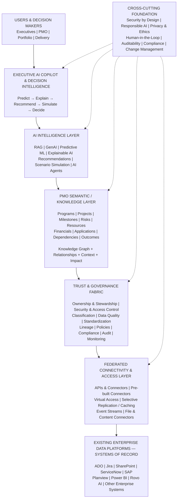

# GIS PMO AI — Federated Data & AI Transformation Strategy

> **From Enterprise Data to Intelligent Decisions**
>
> **Connect the enterprise without centralizing it. Understand the ecosystem without losing source ownership. Apply AI to move PMO from reporting to prediction, recommendation and decision.**

<!-- Source: GIS PMO AI — Federated Data & AI Transformation Strategy :contentReference[oaicite:0]{index=0} -->

---

## Executive Summary

GIS PMO can evolve from a fragmented information-management function into an **intelligent, connected and decision-centric PMO ecosystem** without requiring wholesale centralization of enterprise data.

The strategy is deliberately structured around **two transformation parts**:

### Part 1 — Build the Federated PMO Data Ecosystem

Connect existing enterprise systems through governed interfaces while allowing each system to remain the authoritative source for its own data.

**Discover → Govern → Connect → Understand → Trust**

### Part 2 — Build AI-Powered PMO Intelligence

Once the federated ecosystem is established, layer AI, ML, GenAI, RAG, Knowledge Graphs, predictive analytics, scenario simulation and AI agents on top of the trusted information foundation.

**Understand → Predict → Explain → Recommend → Simulate → Decide**

The result is a **Decision-Centric GIS PMO** that progresses from fragmented reporting to connected intelligence and ultimately to proactive, data-driven decision-making.

---

# 1. The Business Problem

Today's PMO information is distributed across multiple enterprise platforms, each optimized for a particular business or technology function.

Typical sources include:

| Enterprise Platform | Primary Information |
|---|---|
| **Azure DevOps (ADO)** | Delivery management |
| **Jira** | Agile planning, issues and delivery |
| **SharePoint** | Documents and collaboration |
| **ServiceNow** | ITSM, incidents, applications and requests |
| **SAP** | Finance and ERP |
| **Planview** | Portfolio management |
| **Power BI** | Analytics and reporting |
| **Rovo AI** | Existing Atlassian AI capabilities |
| **Other Enterprise Systems** | HR, CRM, Procurement, CMDB and other business platforms |

The challenge is not simply that information exists in multiple systems.

The deeper challenge is **fragmentation**:

- Data exists across different platforms
- Definitions differ across systems
- Data ownership may be unclear
- Governance responsibilities are distributed
- Access mechanisms differ
- Data quality varies
- Relationships between datasets are not explicit
- PMO teams manually consolidate information
- Executives receive information rather than intelligence
- AI cannot reliably reason across disconnected sources

### The fundamental principle

> **The first challenge is not AI. The first challenge is creating a trusted, governed and connected information ecosystem for AI to operate on.**

---

# 2. Strategic Vision

## From Fragmented Information to Decision Intelligence

The transformation follows a deliberate progression:

```text
FRAGMENTED INFORMATION
        │
        ▼
DISCOVER
        │
        ▼
GOVERN
        │
        ▼
CONNECT
        │
        ▼
UNDERSTAND
        │
        ▼
TRUSTED PMO ECOSYSTEM
        │
        ▼
AI INTELLIGENCE
        │
        ├── Predict
        ├── Explain
        ├── Recommend
        ├── Simulate
        │
        ▼
DECIDE
        │
        ▼
STRONGER OUTCOMES
```

The objective is not to create another centralized repository.

The objective is:

> **One logical PMO view — many authoritative enterprise sources.**

---

# 3. Transformation Strategy

The overall strategy consists of two tightly connected parts.

```text
┌───────────────────────────────────────────────────────────────┐
│                 GIS PMO AI TRANSFORMATION                     │
└───────────────────────────────┬───────────────────────────────┘
                                │
              ┌─────────────────┴─────────────────┐
              │                                   │
              ▼                                   ▼
┌─────────────────────────────┐     ┌─────────────────────────────┐
│ PART 1                      │     │ PART 2                      │
│ FEDERATED DATA ECOSYSTEM    │ ──► │ AI-POWERED PMO INTELLIGENCE  │
├─────────────────────────────┤     ├─────────────────────────────┤
│ Discover                    │     │ Understand                  │
│ Govern                      │     │ Predict                     │
│ Connect                     │     │ Explain                     │
│ Understand                  │     │ Recommend                   │
│ Trust                       │     │ Simulate                    │
│                             │     │ Decide                      │
└─────────────────────────────┘     └─────────────────────────────┘
              │                                   │
              └─────────────────┬─────────────────┘
                                ▼
                    ┌────────────────────────┐
                    │ DECISION-CENTRIC PMO   │
                    └────────────────────────┘
```

---

# 4. Target Architecture

The architecture follows a **top-down model**: enterprise systems remain at the foundation, a federated connectivity and governance fabric creates trusted access, a PMO semantic/knowledge layer creates contextual understanding, and AI sits above this foundation to generate intelligence and decisions.



---

# 5. Architecture Principles

The architecture is based on several core principles.

### 5.1 Federate First

Do not begin by copying everything into a new centralized data store.

Instead:

> **Federate First → Integrate Where Needed → Centralize Only When Justified**

---

### 5.2 Preserve Source Ownership

Existing enterprise systems remain authoritative.

The platform does not replace:

- ADO
- Jira
- SharePoint
- ServiceNow
- SAP
- Planview
- Power BI
- Other enterprise systems

Instead, it provides a governed intelligence layer across them.

---

### 5.3 Connect Based on Purpose

Different information requires different access patterns.

Information can be:

- Queried through APIs
- Accessed through connectors
- Virtually federated
- Indexed as metadata
- Selectively replicated
- Cached for performance
- Transformed into semantic representations

This creates an architecture based on **business purpose rather than technology preference**.

---

### 5.4 AI-Ready by Design

AI should not be directly exposed to uncontrolled enterprise information.

The information should first pass through:

```text
Source
  ↓
Connectivity
  ↓
Governance
  ↓
Semantic Understanding
  ↓
Trusted Context
  ↓
AI
```

---

# 6. Part 1 — Federated PMO Data Ecosystem

## Objective

Create a **logical single view of PMO information without creating a physical single repository for everything**.

The target state is:

> **One logical PMO view — many authoritative enterprise sources.**

<!-- Source: Part 1 objective and principle :contentReference[oaicite:1]{index=1} -->

---

# 7. Phase 1.1 — Discover

## Question

> **What data do we have?**

Build an enterprise PMO data landscape covering both structured and unstructured information.

### Activities

- Identify all PMO-relevant data sources
- Identify structured and unstructured information
- Map critical data domains
- Identify systems of record
- Identify duplicate information
- Identify data gaps
- Assess data quality
- Identify integration and API capabilities
- Identify data access patterns
- Identify key consumers of PMO information

### Output

## PMO Data Landscape

A visual inventory representing:

```text
SYSTEM
   ↓
DATA
   ↓
OWNER
   ↓
GOVERNANCE
   ↓
ACCESS
   ↓
CONSUMERS
```

This becomes the baseline for the federated ecosystem.

---

# 8. Phase 1.2 — Establish Ownership

## Question

> **Who owns and governs the data?**

Create a **Data Ownership & Governance Matrix**.

| Data Domain | System | Business Owner | Data Steward | Governance | Access |
|---|---|---|---|---|---|
| Delivery | ADO | PMO / Delivery | Scrum / PMO | Delivery Governance | API |
| Agile / Issues | Jira | Delivery / PMO | Product / Scrum | Delivery Governance | API |
| Documents | SharePoint | PMO | PMO Admin | Information Governance | Graph / API |
| Incidents | ServiceNow | IT | ITSM | IT Governance | API |
| Financials | SAP | Finance | Finance | Financial Governance | API |
| Portfolio | Planview | PMO | Portfolio Team | Portfolio Governance | API |
| Analytics | Power BI | PMO | BI Team | Analytics Governance | Semantic Model |

The ownership model answers:

> **Who governs what, and how does GIS PMO securely consume it?**

---

# 9. Phase 1.3 — Govern

Once ownership is understood, establish common governance across the federated ecosystem.

### Governance Dimensions

| Governance Area | Key Question |
|---|---|
| **Data Ownership** | Who is accountable? |
| **Data Stewardship** | Who maintains it? |
| **Data Quality** | How trustworthy is it? |
| **Security** | Who can access it? |
| **Classification** | What sensitivity applies? |
| **Lineage** | Where did the information originate? |
| **AI Usage** | Can AI consume it? |
| **Auditability** | Can an AI answer be traced back to the source? |
| **Compliance** | Does usage conform to enterprise policies? |

Governance is not a separate activity that happens after implementation.

It becomes part of the architecture itself.

---

# 10. Phase 1.4 — Connect

Once priority sources and governance are established, connect the enterprise systems.

## Connectivity Patterns

```text
┌─────────────────────────────────────────────────────────┐
│             FEDERATED CONNECTIVITY LAYER                │
├─────────────────────────────────────────────────────────┤
│                                                         │
│  APIs & Connectors                                     │
│  ─────────────────                                     │
│  Direct governed access to enterprise platforms        │
│                                                         │
│  Pre-built Connectors                                  │
│  ───────────────────                                   │
│  Accelerated integration with supported platforms      │
│                                                         │
│  Virtual Access                                        │
│  ─────────────                                         │
│  Real-time query without unnecessary replication       │
│                                                         │
│  Selective Replication / Caching                       │
│  ─────────────────────────────                         │
│  Replicate only where performance or analytics require │
│                                                         │
│  Event Streams                                         │
│  ────────────                                          │
│  Webhooks and event-driven updates                     │
│                                                         │
│  File & Content Connectors                             │
│  ───────────────────────                               │
│  Documents and unstructured enterprise knowledge       │
│                                                         │
└─────────────────────────────────────────────────────────┘
```

### Design Principle

> **Not every dataset needs to be copied.**

Use the most appropriate access pattern based on:

- Data sensitivity
- Data volume
- Freshness requirements
- Query requirements
- Performance
- Cost/complexity
- Governance
- AI consumption requirements

---

# 11. Phase 1.5 — Create the PMO Semantic Layer

The semantic layer becomes the bridge between fragmented enterprise systems.

Instead of treating enterprise information as isolated tables and documents, the platform establishes common **PMO concepts and relationships**.

## Core PMO Entities

```text
                         PROGRAM
                            │
              ┌─────────────┼─────────────┐
              │             │             │
              ▼             ▼             ▼
           PROJECT       APPLICATION    OUTCOME
              │
      ┌───────┼────────┬──────────┬──────────┐
      │       │        │          │          │
      ▼       ▼        ▼          ▼          ▼
 MILESTONE   RISK   RESOURCE   DEPENDENCY  FINANCIAL
```

The semantic model enables the platform to understand that:

> Project A belongs to Program B, consumes Resource C, depends on Application D, has Risk E and contributes to Outcome F.

This is where the **PMO Knowledge Model and Knowledge Graph** become especially valuable.

---

# 12. PMO Knowledge Graph

The Knowledge Graph represents relationships between PMO entities and enterprise information.

```text
             ┌───────────────┐
             │    PROGRAM    │
             └───────┬───────┘
                     │ contains
                     ▼
             ┌───────────────┐
             │    PROJECT    │
             └───────┬───────┘
                     │
        ┌────────────┼────────────┐
        │            │            │
        ▼            ▼            ▼
      RISK        RESOURCE    DEPENDENCY
        │            │            │
        │            │            ▼
        │            │       APPLICATION
        │            │
        └────────────┼────────────┐
                     ▼            ▼
                 OUTCOME      FINANCIAL
```

The graph captures:

- Relationships
- Context
- Dependencies
- Impact
- Ownership
- Business outcomes
- Cross-system connections

This enables AI to reason across enterprise information rather than simply retrieve isolated records.

---

# 13. Phase 1.6 — Establish the Trusted PMO View

At the end of Part 1, GIS PMO should have a **trusted logical information layer**.

This does **not** mean:

> "All PMO data is now stored in one database."

It means:

> **PMO can discover, access, understand and correlate governed information across enterprise systems.**

This trusted PMO view becomes the foundation for AI.

---

# 14. Part 2 — AI-Powered PMO Intelligence

Once the federated ecosystem is established, AI can be introduced progressively.

The intelligence lifecycle evolves from:

```text
Observe
   ↓
Understand
   ↓
Predict
   ↓
Explain
   ↓
Recommend
   ↓
Simulate
   ↓
Decide
```

The core executive decision framework remains:

```text
PREDICT → EXPLAIN → RECOMMEND → SIMULATE → DECIDE
```

---

# 15. Phase 2.1 — AI Knowledge

## Question

> **What does the organization know?**

The first AI capability is grounded enterprise knowledge.

### Key Technologies

- Retrieval-Augmented Generation (RAG)
- Enterprise Search
- Enterprise Knowledge
- Metadata
- PMO Semantic Model
- Knowledge Graph
- Governed enterprise sources
- Context-aware retrieval

### Example Questions

```text
"What is the current status of Project X?"

"What decisions were made regarding Program Y?"

"Which risks are associated with the ERP program?"

"What dependencies could impact this program?"
```

### Critical Requirement

> **Every AI answer should be grounded in governed enterprise information.**

The objective is not to create a generic chatbot.

The objective is to create an **enterprise-aware PMO intelligence capability**.

---

# 16. Phase 2.2 — AI Understanding

AI now moves beyond retrieving individual pieces of information.

It begins connecting information across systems.

### Example

```text
ADO
 │
 └── Project Delay
        │
        ▼
ServiceNow
 │
 └── Application Incident
        │
        ▼
SAP
 │
 └── Financial Impact
        │
        ▼
SharePoint
 │
 └── Program Decision
```

AI can reason across these relationships:

> **The delivery delay may be related to the application incident and may create a financial impact, while previous program decisions may influence the available response options.**

This is where the combination of:

**Knowledge Graph + Semantic Model + GenAI + Governed Enterprise Data**

becomes powerful.

---

# 17. Phase 2.3 — Predictive Intelligence

Once sufficient trusted data is available, introduce ML and predictive analytics.

### Predictive Use Cases

| Intelligence Area | Example Prediction |
|---|---|
| **Schedule Risk** | Probability of milestone slippage |
| **Cost Risk** | Probability of budget overrun |
| **Resource Risk** | Probability of resource bottleneck |
| **Delivery Risk** | Probability of project health deterioration |
| **Portfolio Risk** | Emerging systemic risks across programs |

The PMO evolves from:

```text
REACTIVE REPORTING
        ↓
PROACTIVE RISK MANAGEMENT
```

Instead of only reporting what has happened, the PMO begins identifying what is likely to happen next.

---

# 18. Phase 2.4 — Explainable Intelligence

Prediction alone is not sufficient for executive decision-making.

The AI must explain **why** it reached a conclusion.

### Example

```text
Project X

Probability of milestone delay: 72%

Contributing factors:
• Critical dependency delayed
• Resource availability reduced
• High-priority defect backlog increased
• Previous milestone already slipped
```

The intelligence should expose:

- Contributing factors
- Evidence
- Source references
- Confidence
- Context
- Impact

This introduces **Responsible AI and Explainability** into the decision process.

---

# 19. Phase 2.5 — Recommendation Intelligence

The platform progresses from:

> **What is happening?**

to:

> **What should we do?**

### Example

```text
SITUATION

Project Alpha is at high risk.

        ↓

AI RECOMMENDATION

• Reallocate two specialist resources
• Escalate dependency X
• Move milestone Y by one week
```

Recommendations should include:

| Recommendation Attribute | Purpose |
|---|---|
| **Rationale** | Why the recommendation is being made |
| **Evidence** | Supporting enterprise information |
| **Confidence** | AI confidence level |
| **Expected Impact** | Potential consequence |
| **Affected Stakeholders** | Who may be impacted |
| **Source References** | Traceability to enterprise data |

The AI therefore moves from an information assistant toward a **decision-support capability**.

---

# 20. Phase 2.6 — Scenario Simulation

Scenario simulation transforms the solution from an AI assistant into **decision intelligence**.

Executives can ask:

```text
"What happens if we delay Project A by two weeks?"
```

The platform can evaluate potential effects on:

- Dependent projects
- Resources
- Milestones
- Financials
- Risks
- Business outcomes

Another example:

```text
"What happens if we reduce the program team by 10%?"
```

The platform can simulate potential portfolio consequences.

### Decision Simulation Flow

```text
EXECUTIVE QUESTION
        │
        ▼
CURRENT STATE
        │
        ▼
IDENTIFY DEPENDENCIES
        │
        ▼
MODEL POTENTIAL IMPACT
        │
        ▼
SIMULATE SCENARIOS
        │
        ▼
COMPARE OUTCOMES
        │
        ▼
RECOMMEND OPTION
```

---

# 21. Phase 2.7 — Decision Intelligence

The final stage is the **AI Executive Decision Copilot**.

Executives should not need to navigate multiple systems and dashboards to understand a complex portfolio question.

Instead:

```text
EXECUTIVE QUESTION
        │
        ▼
UNDERSTAND CONTEXT
        │
        ▼
RETRIEVE TRUSTED DATA
        │
        ▼
CORRELATE ENTERPRISE KNOWLEDGE
        │
        ▼
PREDICT
        │
        ▼
EXPLAIN
        │
        ▼
RECOMMEND
        │
        ▼
SIMULATE
        │
        ▼
DECISION
```

The AI therefore becomes:

> **An intelligence layer over the PMO ecosystem — not simply a chatbot.**

---

# 22. Executive Decision Intelligence Framework

The central value proposition can be summarized as:

```text
┌──────────┐     ┌─────────┐     ┌────────────┐
│ PREDICT  │ ──► │ EXPLAIN │ ──► │ RECOMMEND  │
└──────────┘     └─────────┘     └────────────┘
                                      │
                                      ▼
                               ┌────────────┐
                               │ SIMULATE   │
                               └─────┬──────┘
                                     │
                                     ▼
                               ┌────────────┐
                               │   DECIDE   │
                               └─────┬──────┘
                                     │
                                     ▼
                         ┌────────────────────────┐
                         │ BETTER DECISIONS       │
                         │ STRONGER OUTCOMES      │
                         │ GREATER VALUE          │
                         └────────────────────────┘
```

---

# 23. AI Intelligence Capability Model

The AI layer combines multiple complementary capabilities.

| Capability | Purpose |
|---|---|
| **Knowledge Retrieval / RAG** | Enterprise search, contextual Q&A and grounded answers |
| **GenAI & Summarization** | Meeting summaries, status summaries and executive briefings |
| **Predictive Analytics / ML** | Schedule, cost, resource, delivery and portfolio risk |
| **Explainable AI** | Why a prediction or recommendation was generated |
| **Recommendations** | Next-best actions and decision support |
| **Scenario Simulation** | What-if analysis and impact simulation |
| **AI Agents / Copilots** | Specialized PMO intelligence and task support |

---

# 24. AI Agent Evolution

AI agents should not all be built on day one.

The architecture should evolve progressively.

## Stage 1 — Executive PMO Copilot

Initial capability:

```text
EXECUTIVE PMO COPILOT
```

Focus:

- Enterprise PMO questions
- Portfolio summaries
- Executive briefings
- Risk visibility
- Contextual information retrieval

---

## Stage 2 — Specialized Intelligence

Introduce:

```text
Portfolio Agent
Risk Agent
Financial Agent
```

Each agent develops deeper domain-specific reasoning.

---

## Stage 3 — Expanded PMO Agents

Introduce:

```text
Resource Agent
Dependency Agent
Delivery Agent
```

These agents reason over increasingly interconnected PMO information.

---

## Stage 4 — Multi-Agent PMO Intelligence

Specialized agents collaborate.

Example executive question:

> **"Which programs are most likely to miss strategic objectives, why, and what should we do?"**

Potential collaboration:

```text
Portfolio Agent
       │
       ├──────────────┐
       ▼              ▼
Risk Agent      Resource Agent
       │              │
       └──────┬───────┘
              ▼
       Financial Agent
              │
              ▼
      Integrated Decision
```

The result is **multi-agent PMO intelligence**, rather than isolated AI assistants.

---

# 25. Cross-Cutting Responsible AI Foundation

Responsible AI is not a final implementation phase.

It should span **both Part 1 and Part 2**.

```text
                    RESPONSIBLE AI
                          │
        ┌─────────────────┼─────────────────┐
        │                 │                 │
     SECURITY           PRIVACY          GOVERNANCE
        │                 │                 │
     ACCESS          CLASSIFICATION      POLICIES
        │                 │                 │
        └─────────────────┼─────────────────┘
                          │
                   EXPLAINABILITY
                          │
                    AUDITABILITY
                          │
                  HUMAN OVERSIGHT
```

### Core Principles

- Trusted
- Transparent
- Explainable
- Secure
- Auditable
- Human-in-the-loop
- Policy compliant
- Privacy-aware
- Governed

---

# 26. Cross-Cutting Architecture Foundation

The following capabilities apply throughout the architecture:

```text
┌────────────────────────────────────────────────────────────┐
│                 CROSS-CUTTING FOUNDATION                   │
├────────────────────────────────────────────────────────────┤
│                                                            │
│ Security by Design                                         │
│ Responsible AI                                             │
│ Privacy & Ethics                                           │
│ Human-in-the-Loop                                          │
│ Auditability                                               │
│ Compliance                                                 │
│ Change Management & Adoption                               │
│                                                            │
└────────────────────────────────────────────────────────────┘
```

These capabilities ensure that intelligence is not only powerful, but also **trusted and adoptable**.

---

# 27. Overall Transformation Roadmap

```text
                         GIS PMO AI TRANSFORMATION
                                  │
                ┌─────────────────┴─────────────────┐
                │                                   │
                ▼                                   ▼
        PART 1 — DATA                       PART 2 — AI
        FEDERATION                           INTELLIGENCE
                │                                   │
       ┌────────┼────────┐                 ┌────────┼────────┐
       │        │        │                 │        │        │
   Discover  Govern   Connect          Understand Predict Recommend
       │        │        │                 │        │        │
       └────────┼────────┘                 └────────┼────────┘
                │                                   │
                ▼                                   ▼
       Semantic / Knowledge                 Explain + Simulate
             Model                                │
                │                                   │
                └────────────────┬──────────────────┘
                                 │
                                 ▼
                       DECISION INTELLIGENCE
                                 │
                                 ▼
                      EXECUTIVE PMO COPILOT
```

---

# 28. Implementation Methodology

The recommended implementation methodology is:

# Federate → Establish → Connect → Understand → Intelligence → Scale

---

## Stage 1 — Federate

Understand the fragmented enterprise landscape.

### Focus

- Identify systems of record
- Identify PMO data domains
- Map information flows
- Identify data gaps
- Identify integration opportunities
- Avoid unnecessary centralization

### Outcome

A clear **PMO Data Landscape**.

---

## Stage 2 — Establish

Establish the governance foundation.

### Focus

- Data ownership
- Data stewardship
- Security
- Access control
- Classification
- Data quality
- Policies
- Lineage
- Auditability

### Outcome

A **Trusted PMO Governance Model**.

---

## Stage 3 — Connect

Connect priority enterprise sources.

### Focus

- APIs
- Connectors
- Virtual access
- Event streams
- Selective replication
- File/content access

### Outcome

A **Federated Connectivity Layer**.

---

## Stage 4 — Understand

Create common PMO meaning.

### Focus

- PMO semantic model
- Common entities
- Metadata
- Relationships
- Knowledge Graph
- Context
- Business outcomes

### Outcome

A **Trusted PMO Knowledge Layer**.

---

## Stage 5 — Intelligence

Introduce AI capabilities progressively.

### Focus

```text
RAG
 ↓
GenAI
 ↓
Predictive ML
 ↓
Explainable AI
 ↓
Recommendations
 ↓
Scenario Simulation
 ↓
AI Agents
 ↓
Decision Intelligence
```

### Outcome

An **AI-Powered PMO Intelligence Layer**.

---

## Stage 6 — Scale

Expand the ecosystem after proving value.

### Scale Across

- More enterprise data sources
- More PMO use cases
- More AI capabilities
- More AI agents
- More business stakeholders
- More decision scenarios

### Outcome

A **Decision-Centric GIS PMO**.

---

# 29. Start Small, Scale Smart

The transformation should not begin with an enormous first release.

Start with a focused set of high-value executive questions.

## Use Case 1 — Portfolio Health

> **"What projects are at risk?"**

---

## Use Case 2 — Executive Status

> **"What do I need to know this week?"**

---

## Use Case 3 — Risk Intelligence

> **"Which risks could impact strategic programs?"**

---

## Use Case 4 — Dependency Intelligence

> **"Which projects are dependent on delayed initiatives?"**

---

## Prove → Trust → Expand

```text
START SMALL
     │
     ▼
PROVE VALUE
     │
     ▼
BUILD TRUST
     │
     ▼
EXPAND DATA
     │
     ▼
EXPAND KNOWLEDGE
     │
     ▼
EXPAND AI
     │
     ▼
EXPAND DECISIONS
```

This approach reduces transformation risk while creating a foundation for progressive scale.

---

# 30. Example End-to-End Executive Scenario

Consider an executive asking:

> **"Which strategic programs are most likely to miss their objectives, why, and what should we do?"**

The platform performs the following:

```text
1. UNDERSTAND
   Retrieve current PMO context
          ↓
2. CONNECT
   Correlate ADO + Jira + Planview + ServiceNow
   + SAP + SharePoint + other enterprise information
          ↓
3. REASON
   Use PMO Semantic Model + Knowledge Graph
          ↓
4. PREDICT
   Identify programs with elevated risk
          ↓
5. EXPLAIN
   Identify contributing factors
          ↓
6. RECOMMEND
   Suggest next-best actions
          ↓
7. SIMULATE
   Evaluate alternative interventions
          ↓
8. DECIDE
   Present decision-ready options to the executive
```

This represents the transition from **information retrieval to decision intelligence**.

---

# 31. Target-State Capability Maturity

GIS PMO ultimately evolves through five maturity levels.

| Level | Capability | Description |
|---|---|---|
| **1 — Fragmented** | Information | Information exists in disconnected systems |
| **2 — Connected** | Access | Systems become discoverable and accessible |
| **3 — Intelligent** | Understanding | AI understands enterprise PMO knowledge |
| **4 — Predictive** | Foresight | AI identifies emerging risks and outcomes |
| **5 — Decision-Centric** | Decision Intelligence | AI recommends and simulates decisions |

### Target State

# Decision-Centric PMO

---

# 32. Business Value Evolution

The transformation creates a progressive value journey.

```text
FRAGMENTED DATA
       │
       ▼
CONNECTED INFORMATION
       │
       ▼
TRUSTED PMO VIEW
       │
       ▼
ENTERPRISE CONTEXT
       │
       ▼
INTELLIGENT INSIGHTS
       │
       ▼
PREDICTIVE RISK
       │
       ▼
ACTIONABLE RECOMMENDATIONS
       │
       ▼
SCENARIO-BASED DECISIONS
       │
       ▼
PROACTIVE PMO
```

The PMO moves from asking:

> **"What happened?"**

to:

> **"What is happening?"**

then:

> **"What is likely to happen?"**

then:

> **"Why is it happening?"**

then:

> **"What should we do?"**

and finally:

> **"What happens if we choose this option?"**

---

# 33. What This Architecture Is — and Is Not

## This Architecture Is

- A federated enterprise information ecosystem
- A governed PMO intelligence platform
- A semantic and knowledge-driven architecture
- An AI-ready foundation
- A predictive PMO capability
- A recommendation and simulation engine
- An executive decision intelligence platform
- A progressive AI-agent architecture

## This Architecture Is Not

- A replacement for Jira
- A replacement for ADO
- A replacement for Planview
- A replacement for ServiceNow
- A replacement for SAP
- A replacement for SharePoint
- A replacement for Power BI
- A single centralized repository for all enterprise data
- A standalone chatbot

The platform sits **above and across the existing ecosystem**.

---

# 34. Key Architectural Differentiators

### 1. Federation Before AI

The solution recognizes that AI quality depends on the quality, context and governance of the information available to it.

### 2. Source Ownership Is Preserved

Existing systems remain authoritative.

### 3. Semantic Understanding

The platform creates a common PMO language across fragmented systems.

### 4. Knowledge Graph Context

Relationships and dependencies become machine-understandable.

### 5. Governed AI

AI operates within security, privacy, governance, compliance and auditability boundaries.

### 6. Progressive Intelligence

The platform evolves from retrieval to prediction, recommendation and simulation.

### 7. Decision-Centric Design

The end goal is not an AI chatbot.

The end goal is **better decision-making**.

---

# 35. Reference Architecture Summary

```text
┌─────────────────────────────────────────────────────────────────────┐
│                         USERS / LEADERS                             │
│              Executive | PMO | Portfolio | Delivery                │
└───────────────────────────────┬─────────────────────────────────────┘
                                │
                                ▼
┌─────────────────────────────────────────────────────────────────────┐
│               EXECUTIVE AI COPILOT & DECISION INTELLIGENCE          │
│                                                                     │
│          PREDICT → EXPLAIN → RECOMMEND → SIMULATE → DECIDE          │
└───────────────────────────────┬─────────────────────────────────────┘
                                │
                                ▼
┌─────────────────────────────────────────────────────────────────────┐
│                       AI INTELLIGENCE LAYER                         │
│                                                                     │
│ RAG | GenAI | Predictive ML | Explainable AI | Recommendations     │
│ Scenario Simulation | AI Agents | Contextual Reasoning             │
└───────────────────────────────┬─────────────────────────────────────┘
                                │
                                ▼
┌─────────────────────────────────────────────────────────────────────┐
│                 PMO SEMANTIC / KNOWLEDGE LAYER                     │
│                                                                     │
│ Programs | Projects | Risks | Resources | Financials | Outcomes    │
│ Applications | Milestones | Dependencies | Knowledge Graph        │
└───────────────────────────────┬─────────────────────────────────────┘
                                │
                                ▼
┌─────────────────────────────────────────────────────────────────────┐
│                    TRUST & GOVERNANCE FABRIC                        │
│                                                                     │
│ Ownership | Stewardship | Security | Classification | Quality      │
│ Lineage | Policies | Compliance | Audit | Monitoring               │
└───────────────────────────────┬─────────────────────────────────────┘
                                │
                                ▼
┌─────────────────────────────────────────────────────────────────────┐
│                 FEDERATED CONNECTIVITY & ACCESS                     │
│                                                                     │
│ APIs | Connectors | Virtual Access | Replication | Caching         │
│ Event Streams | Webhooks | File & Content Connectors               │
└───────────────────────────────┬─────────────────────────────────────┘
                                │
                                ▼
┌─────────────────────────────────────────────────────────────────────┐
│              EXISTING ENTERPRISE SYSTEMS OF RECORD                 │
│                                                                     │
│ ADO | Jira | SharePoint | ServiceNow | SAP | Planview              │
│ Power BI | Rovo AI | HR | CRM | Procurement | CMDB | Others        │
└─────────────────────────────────────────────────────────────────────┘
```

---

# 36. Transformation in One View

| Dimension | Current State | Target State |
|---|---|---|
| **Data** | Fragmented | Federated |
| **Systems** | Siloed | Connected |
| **Ownership** | Distributed / unclear | Explicit and governed |
| **Access** | System-specific | Governed federated access |
| **Meaning** | Different definitions | Common PMO semantic model |
| **Relationships** | Implicit | Knowledge Graph |
| **Reporting** | Reactive | Intelligent |
| **Risk** | Identified after events | Predicted proactively |
| **Recommendations** | Human/manual | AI-assisted |
| **Scenario Planning** | Manual | AI-powered simulation |
| **Decisions** | Dashboard-driven | Intelligence-driven |
| **AI** | Isolated / limited context | Enterprise-contextual AI |
| **PMO** | Reporting-centric | Decision-centric |

---

# 37. Implementation Guardrails

The transformation should follow these principles:

### Guardrail 1 — Do Not Centralize by Default

Federate information wherever practical.

### Guardrail 2 — Do Not Introduce AI Before Governance

Ensure data can be securely and responsibly consumed.

### Guardrail 3 — Do Not Treat All Data Equally

Prioritize high-value PMO information and use cases.

### Guardrail 4 — Do Not Build Every Agent Immediately

Start with the Executive PMO Copilot and progressively specialize.

### Guardrail 5 — Do Not Hide AI Reasoning

Expose evidence, confidence, contributing factors and source references.

### Guardrail 6 — Keep Humans in the Loop

AI should support decisions, while accountable stakeholders retain decision authority.

### Guardrail 7 — Measure Adoption and Value

Technology implementation alone does not constitute transformation.

---

# 38. Success Indicators

The target state should demonstrate improvement across several dimensions.

## Data

- Increased discoverability
- Improved data quality
- Clearer ownership
- Better lineage
- Reduced manual consolidation

## PMO

- Faster portfolio visibility
- Improved cross-project dependency understanding
- Earlier risk identification
- Reduced reporting effort
- Better executive visibility

## AI

- Higher-quality grounded answers
- Explainable predictions
- Actionable recommendations
- Scenario-based decision support
- Progressive agent adoption

## Decision-Making

- Faster access to decision context
- Better understanding of trade-offs
- More proactive intervention
- Stronger alignment between projects and business outcomes

---

# 39. Future-State Vision

The long-term vision is a **self-improving PMO intelligence ecosystem**.

```text
ENTERPRISE SYSTEMS
        │
        ▼
FEDERATED DATA
        │
        ▼
TRUSTED KNOWLEDGE
        │
        ▼
AI UNDERSTANDING
        │
        ▼
PREDICTIVE INTELLIGENCE
        │
        ▼
RECOMMENDATIONS
        │
        ▼
SCENARIO SIMULATION
        │
        ▼
EXECUTIVE DECISION
        │
        ▼
BUSINESS OUTCOME
        │
        └──────────────► LEARNING / FEEDBACK
                              │
                              ▼
                       IMPROVED INTELLIGENCE
```

Over time, the PMO evolves from a function that **reports information** into a capability that continuously **understands, predicts, recommends and supports decisions**.

---

# 40. Final Executive Narrative

> **GIS PMO does not need another repository. It needs an intelligence ecosystem.**

Enterprise information already exists across ADO, SharePoint, ServiceNow, SAP, Power BI and other enterprise platforms.

The opportunity is to connect these existing sources through a **governed federated architecture**, establish a common **PMO semantic and knowledge model**, and then apply AI to transform fragmented information into actionable intelligence.

The transformation therefore happens in two deliberate steps:

### Part 1 — Federate the Data Ecosystem

**Discover → Govern → Connect → Understand → Trust**

### Part 2 — Build AI-Powered Decision Intelligence

**Understand → Predict → Explain → Recommend → Simulate → Decide**

The result is an **AI-first GIS PMO** that moves from fragmented reporting to connected intelligence and ultimately to proactive, data-driven decision-making.

---

# 41. The One-Line Strategy

> ## **"Connect the enterprise without centralizing it; understand the ecosystem without losing source ownership; and apply AI to move PMO from reporting to prediction, recommendation and decision."**

---

# 42. Conclusion

The GIS PMO AI strategy is fundamentally **not an AI-first technology deployment**.

It is a **data-to-intelligence transformation**.

The first step is to create the trusted foundation:

```text
DISCOVER
   ↓
GOVERN
   ↓
CONNECT
   ↓
UNDERSTAND
   ↓
TRUST
```

The second step is to activate intelligence:

```text
UNDERSTAND
   ↓
PREDICT
   ↓
EXPLAIN
   ↓
RECOMMEND
   ↓
SIMULATE
   ↓
DECIDE
```

Together, these create a new PMO operating model:

```text
                 FRAGMENTED PMO
                       │
                       ▼
             FEDERATED DATA ECOSYSTEM
                       │
                       ▼
              TRUSTED PMO KNOWLEDGE
                       │
                       ▼
               AI INTELLIGENCE
                       │
             ┌─────────┼─────────┐
             ▼         ▼         ▼
          PREDICT   RECOMMEND  SIMULATE
             │         │         │
             └─────────┼─────────┘
                       ▼
                   DECIDE
                       │
                       ▼
              DECISION-CENTRIC PMO
```

## Final Outcome

**From fragmented information → connected data → trusted knowledge → AI-powered intelligence → confident decisions → stronger outcomes.**

---

## Strategic North Star

```text
PART 1
FEDERATED DATA ECOSYSTEM

Discover → Govern → Connect → Understand → Trust

                         +
                         
PART 2
AI-POWERED PMO INTELLIGENCE

Understand → Predict → Explain → Recommend → Simulate → Decide

                         ↓

              DECISION-CENTRIC GIS PMO
```

> **The strategic principle is simple: build the trusted ecosystem first, then put intelligence on top of it.**
