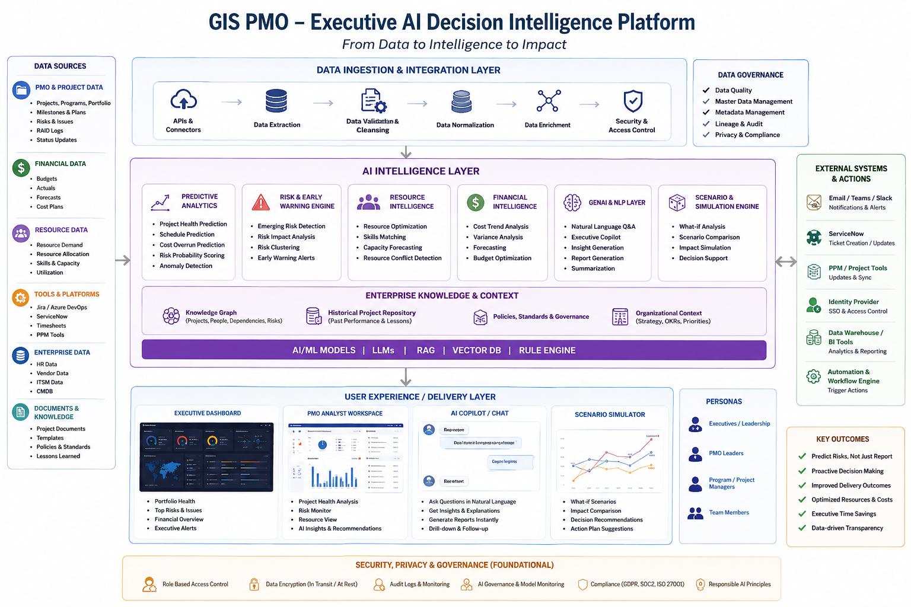

# ai-powered-gis-pmo-decision-intelligence
AI-powered transformation of GIS PMO platform into a predictive delivery excellence and executive decision intelligence platform.

# GIS PMO – Executive AI Decision Intelligence Platform

**Author:** Manisha Kriplani
**Organization / Context:** GIS – Global IT Services, LAM Research
**Focus:** AI-enabled PMO Delivery Excellence

## 📌 Overview

The **GIS PMO – Executive AI Decision Intelligence Platform** is a proposed AI-powered evolution of an existing **SharePoint-based GIS PMO platform**.

The objective is not to replace the existing PMO website, but to introduce an **AI Intelligence Layer** that transforms project and portfolio data into:

* Predictive insights
* Early-warning signals
* Root-cause analysis
* Executive recommendations
* Scenario simulations
* AI-generated reporting
* Intelligent decision support

### Transformation

**Traditional PMO**

> Monitor → Report → Escalate

**AI-Powered PMO**

> Predict → Explain → Recommend → Simulate → Decide

The initiative aims to move GIS PMO from a primarily **retrospective reporting and governance function** toward a **proactive, predictive and AI-enabled delivery excellence function**.


# Business Problem

The existing GIS PMO SharePoint platform provides centralized visibility into projects, programs, milestones, risks, resources and financial information.

However, traditional PMO reporting is largely **descriptive and retrospective**.

Leadership can see:

> **What happened?**

But increasingly needs answers to:

> **What is likely to happen?**

> **Why is it happening?**

> **What should we do?**

> **What will happen if we take a particular action?**

### Key challenges

* Manual project health and RAG assessments
* Reactive risk identification
* Fragmented project, resource and financial information
* Significant effort spent preparing executive reports
* Limited ability to predict schedule delays
* Limited ability to predict cost overruns
* Difficulty identifying emerging portfolio-level risks
* Heavy dependence on manual analysis for executive decisions

---

# Strategic Objective

The strategic question for GIS leadership is:

> **How can AI transform the existing SharePoint-based GIS PMO from a reporting and governance platform into a predictive delivery-excellence and executive decision-intelligence platform?**

The objective is to **augment the existing PMO investment with AI**, rather than create another standalone PMO portal.


# Proposed Solution

The proposed solution is an **Executive AI Decision Intelligence Layer** integrated with the existing SharePoint-based GIS PMO.

The platform combines:

* Predictive Analytics
* Machine Learning
* Generative AI
* Retrieval-Augmented Generation (RAG)
* Enterprise Knowledge
* Knowledge Graphs
* Scenario Simulation
* Resource Intelligence
* Financial Intelligence
* AI Executive Copilot
* Responsible AI Governance

The platform continuously analyzes trusted project and enterprise information and converts it into **actionable delivery intelligence**.


# Solution Architecture

```text
                 EXISTING GIS PMO
              SharePoint Platform
                       │
        ┌──────────────┼──────────────┐
        │              │              │
   SharePoint       PMO Data      Documents &
   Lists/Pages      & Dashboards   Knowledge
        │              │              │
        └──────────────┼──────────────┘
                       ↓
             DATA / INTEGRATION LAYER
                       ↓
              AI INTELLIGENCE LAYER
        ┌──────────────┼──────────────┐
        │              │              │
   Predictive      GenAI / RAG     Scenario &
   Analytics       AI Copilot      Simulation
        │              │              │
        └──────────────┼──────────────┘
                       ↓
          ENTERPRISE KNOWLEDGE & CONTEXT
                       ↓
           EXECUTIVE DECISION ENGINE
        ┌──────────────┼──────────────┐
        │              │              │
    Dashboard       AI Copilot     Simulator
        │              │              │
        └──────────────┼──────────────┘
                       ↓
             PROACTIVE DECISIONS
```

### Architecture Visual



---

# 🔌 Data Sources

The AI platform can consume information from the existing SharePoint PMO and connected enterprise systems.

### PMO & Project Data

* Projects and programs
* Portfolio information
* Milestones
* Risks and issues
* RAID logs
* Project status updates
* Dependencies

### Financial Data

* Budgets
* Actuals
* Forecasts
* Cost plans
* Budget variance

### Resource Data

* Resource demand
* Resource allocation
* Skills and capabilities
* Capacity
* Utilization

### Tools & Platforms

Potential integrations include:

* Jira
* Azure DevOps
* ServiceNow
* Timesheets
* PPM tools
* Enterprise reporting platforms

### Enterprise Data

* HR data
* Vendor information
* ITSM data
* CMDB information
* Enterprise data warehouse

### Documents & Knowledge

* Project documents
* Governance documents
* Policies and standards
* Templates
* Lessons learned
* Steering committee materials

---

# 🧠 AI Intelligence Layer

## 1. Predictive Project Health

Instead of relying entirely on manually assigned RAG status, AI calculates a dynamic project health score.

### Example

> **Project Health Score: 68/100 – At Risk**

**AI prediction:**

> 78% probability of milestone delay within the next four weeks.

### Potential contributing factors

* Critical dependency delays
* Increasing resource utilization
* Unresolved high-priority risks
* Declining sprint velocity
* Increasing change requests

This makes project health **data-driven and explainable**.

---

# 🚨 2. Risk & Early-Warning Engine

AI identifies emerging delivery risks before they become major issues.

### Example

**Potential Schedule Risk Detected**

* Probability: **78%**
* Impact: **High**
* Primary drivers: **Resource constraint + vendor dependency**
* Expected delay: **3–5 weeks**

The PMO can therefore move from:

> **Reactive escalation**

to:

> **Proactive intervention**

---

# 👥 3. Resource Intelligence

AI analyzes:

* Resource availability
* Skills
* Capacity
* Utilization
* Project priority
* Resource conflicts
* Demand versus supply

### Example

> Three critical projects are competing for the same cloud engineering capability.

AI can recommend alternative resource allocation strategies and highlight the potential impact of each option.

---

# 💰 4. Financial Intelligence

AI analyzes:

* Budget variance
* Cost trends
* Forecasts
* Spending patterns
* Cost risk
* Portfolio-level financial performance

It can identify potential financial issues before they become significant overruns.

---

# 🤖 5. Executive AI Copilot

Executives and PMO leaders can interact with the platform using natural language.

### Example questions

```text
Which projects are most likely to miss their milestones?

Why is Project X Amber?

Which programs require executive intervention?

What are the top five risks across the GIS portfolio?

Show me projects with increasing financial risk.

What changed in portfolio health this month?

Which projects have resource constraints?

What are the major dependencies affecting delivery?
```

The AI Copilot converts complex PMO information into conversational insights and recommendations.

---

# 🔮 6. What-If Scenario Simulator

This is one of the most strategic capabilities of the platform.

Executives can test potential decisions before implementing them.

### Example

> **"What happens if we reduce project resources by 10%?"**

The AI can estimate potential changes in:

* Projects at risk
* Schedule delays
* Resource utilization
* Financial impact
* Critical program impact

It can then recommend the best course of action.

### Example recommendation

> **Avoid a uniform resource reduction. Protect strategic programs and optimize resources across lower-priority initiatives.**

This moves the PMO beyond reporting into **Decision Intelligence**.

---

# 📊 7. AI-Generated Executive Reporting

AI can automatically generate:

* Weekly executive summaries
* Portfolio health reports
* Steering committee summaries
* Risk summaries
* Project exception reports
* Decision papers
* Executive presentations

This reduces manual PMO effort spent consolidating and interpreting information.

---

# 🕵️ 8. Executive Early-Warning System

Executives should not need to continuously monitor dashboards.

The AI platform can proactively surface exceptions.

### Example

> 🔴 **Executive Attention Required**
>
> **Project:** Enterprise Cloud Transformation
> **Risk:** Schedule slippage
> **Probability:** 82%
> **Potential Impact:** High
> **Recommended Action:** Approve temporary resource augmentation.

This enables **exception-based management**.

---

# 🧩 Enterprise Knowledge & Context

AI recommendations should be based not only on current project data but also on organizational knowledge.

## Knowledge Graph

Represents relationships between:

* Projects
* People
* Dependencies
* Risks
* Vendors
* Technologies
* Business priorities

## Historical Project Repository

Contains:

* Historical project performance
* Previous risks
* Project outcomes
* Lessons learned

## Policies & Governance

Includes:

* PMO standards
* Governance policies
* Organizational rules
* Decision frameworks

## Organizational Context

Includes:

* Strategic priorities
* OKRs
* Business objectives
* Portfolio priorities

---

# 🛠️ Technology Stack

A potential Microsoft-aligned technology ecosystem could include:

| Technology                   | Potential Role                                |
| ---------------------------- | --------------------------------------------- |
| **SharePoint**               | Existing GIS PMO platform                     |
| **Microsoft Graph / APIs**   | Integration with SharePoint and Microsoft 365 |
| **Microsoft Fabric / Azure** | Enterprise data and analytics                 |
| **Azure Machine Learning**   | Predictive models                             |
| **Azure OpenAI**             | Generative AI and LLM capabilities            |
| **Azure AI Search**          | Enterprise search and RAG                     |
| **Power BI**                 | Executive dashboards                          |
| **Power Automate**           | Workflow automation                           |
| **Microsoft Teams**          | Alerts and collaboration                      |
| **Microsoft Entra ID**       | Identity and access management                |
| **Copilot Studio**           | Conversational AI / PMO Copilot               |

> Technology selection should ultimately align with the organization's existing enterprise architecture, security and technology standards.

---

# 👩‍💼 Executive Experience

## Executive Dashboard

Provides:

* Portfolio health
* Top risks
* Financial overview
* Executive alerts
* Delivery trends

## PMO Analyst Workspace

Provides:

* Project health analysis
* Risk monitoring
* Resource visibility
* AI insights
* Recommendations

## AI Copilot

Provides:

* Natural-language questions
* Explanations
* Automated summaries
* Report generation
* Drill-down analysis

## Scenario Simulator

Provides:

* What-if scenarios
* Impact comparison
* Decision recommendations
* Action planning

---

# 🎯 Key Features

| Capability                  | Business Value                              |
| --------------------------- | ------------------------------------------- |
| **AI Project Health Score** | Data-driven project health                  |
| **Predictive Risk Engine**  | Early identification of risks               |
| **Schedule Prediction**     | Anticipates milestone delays                |
| **Cost Prediction**         | Identifies potential financial overruns     |
| **Resource Intelligence**   | Improves resource allocation                |
| **Executive AI Copilot**    | Enables natural-language portfolio analysis |
| **AI Reporting**            | Reduces manual reporting effort             |
| **What-If Simulation**      | Supports scenario-based decisions           |
| **Portfolio Intelligence**  | Identifies cross-project risks              |
| **Early-Warning Alerts**    | Enables proactive intervention              |

---

# 🔐 Responsible AI & Governance

Because the platform operates on enterprise project, financial and resource information, governance is a foundational component.

### Key controls

* Role-based access control
* Data encryption
* Secure APIs
* Data privacy
* Audit logging
* AI governance
* Model monitoring
* Explainable AI
* Human-in-the-loop decision making
* Compliance controls

Every important AI recommendation should ideally provide:

> **Recommendation + Evidence + Confidence + Reasoning**

AI should **augment PMO and executive decision-making rather than replace human accountability**.

---

# 🚀 Implementation Roadmap

## Phase 1 – Foundation | 0–3 Months

* Integrate PMO data sources
* Establish data quality standards
* Build AI data layer
* Introduce AI-generated executive summaries

## Phase 2 – Predictive PMO | 3–6 Months

* Project health prediction
* Risk prediction
* Schedule prediction
* Early-warning alerts

## Phase 3 – Decision Intelligence | 6–12 Months

* Executive AI Copilot
* Scenario simulation
* Resource optimization
* Portfolio recommendations

## Phase 4 – Intelligent PMO | 12+ Months

Progress toward AI agents that can continuously:

> **Monitor → Detect → Analyze → Recommend → Trigger Workflows**

with appropriate human approval for high-impact decisions.

---

# 📈 Expected Business Impact

## Delivery Excellence

* Earlier risk detection
* Improved milestone adherence
* Reduced delivery delays
* Better portfolio visibility

## Productivity

* Reduced manual reporting
* Faster data consolidation
* Automated executive summaries
* More PMO capacity for strategic activities

## Executive Decision-Making

* Faster access to insights
* Evidence-based decisions
* Proactive intervention
* Scenario-based planning

## Financial Performance

* Improved resource utilization
* Reduced cost overruns
* Better investment prioritization
* Improved portfolio efficiency

---

# 📌 Illustrative Success Metrics

The following are **proposed targets for the transformation**, not actual LAM Research results.

| KPI                                | Illustrative Target |
| ---------------------------------- | ------------------: |
| AI-enabled project health coverage |                90%+ |
| Early risk detection               |   4–6 weeks earlier |
| PMO reporting effort               |    30–40% reduction |
| Executive reporting automation     |                70%+ |
| Schedule prediction accuracy       |                80%+ |
| PMO AI adoption                    |                80%+ |
| Executive decision turnaround      |       25% reduction |
| Manual data consolidation          |       40% reduction |

---

# ⚠️ Key Challenges

## Data Quality

AI predictions depend on the accuracy and completeness of PMO data.

## AI Trust

Executives need confidence that AI recommendations are explainable and grounded in reliable information.

## Hallucination Risk

Generative AI must be grounded in trusted enterprise sources using techniques such as RAG and controlled retrieval.

## Change Management

PMO professionals need to understand that AI is an **augmentation capability rather than a replacement for their expertise**.

## Security

Project, financial, resource and enterprise information requires strong identity, access and data-security controls.

## Adoption

The AI capabilities must be embedded into existing PMO workflows rather than becoming another disconnected tool.

---

# 🔄 Traditional vs AI-Powered PMO

### Traditional PMO

```text
Data
  ↓
Dashboard
  ↓
Human Analysis
  ↓
Escalation
  ↓
Decision
```

### AI-Powered PMO

```text
Data
  ↓
AI Analysis
  ↓
Prediction
  ↓
Explanation
  ↓
Recommendation
  ↓
Simulation
  ↓
Executive Decision
```

---

# 💡 Strategic Value Proposition

The transformation can be summarized as:

> **From Project Visibility to Predictive Delivery**
> **From Reporting to Intelligence**
> **From Escalation to Proactive Decision-Making**

The objective is to transform the GIS PMO from a **system of record** into a **system of intelligence**.

The platform enables GIS leadership to answer five critical questions:

1. **What is happening?**
2. **What is likely to happen?**
3. **Why is it happening?**
4. **What should we do?**
5. **What will happen if we do it?**

---

# 🏁 Conclusion

The **Executive AI Decision Intelligence Platform** represents an evolution of the existing **SharePoint-based GIS PMO**, rather than a standalone technology implementation.

By combining PMO data, predictive analytics, Generative AI, enterprise knowledge and scenario simulation, GIS can move toward a more proactive and intelligent delivery model.

The ultimate ambition is to create a PMO that can:

> **Anticipate delivery risks → Explain their causes → Recommend interventions → Simulate outcomes → Enable better executive decisions.**

This represents the next evolution of **AI-enabled PMO Delivery Excellence**.

---

## 👤 Author

**Manisha Kriplani**

AI & Digital Transformation | Program Management | Delivery Excellence
