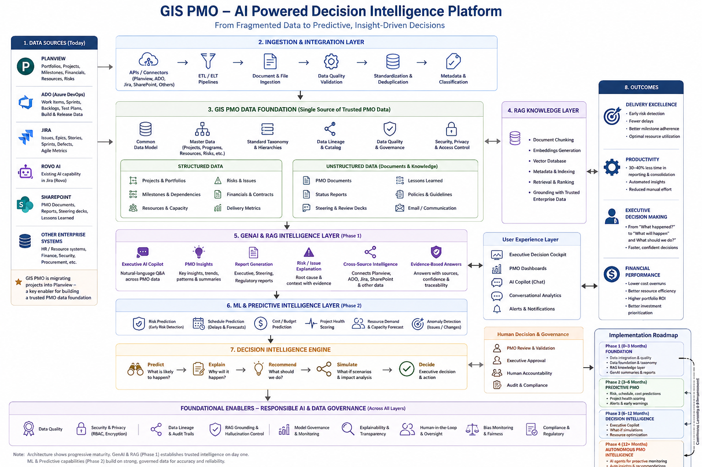

# ai-powered-gis-pmo-decision-intelligence
AI-powered transformation of GIS PMO platform into a predictive delivery excellence and executive decision intelligence platform.

# GIS PMO – Executive AI Decision Intelligence Platform

**Author:** Manisha Kriplani


## 📌 Overview

The **GIS PMO – Executive AI Decision Intelligence Platform** is a proposed AI-powered evolution of GIS PMO platform**.

The objective is not to replace the existing PMO platform, but to introduce an **AI Intelligence Layer** that transforms project and portfolio data into:

* Predictive insights
* Early-warning signals
* Root-cause analysis
* Executive recommendations
* Scenario simulations
* AI-generated reporting
* Intelligent decision support

### Transformation

**Traditional PMO**

> Monitor → Report → Escalate

**AI-Powered PMO**

> Predict → Explain → Recommend → Simulate → Decide

The initiative aims to move GIS PMO from a primarily **retrospective reporting and governance function** toward a **proactive, predictive and AI-enabled delivery excellence function**.


# Business Problem

The existing GIS PMO platform provides centralized visibility into projects, programs, milestones, risks, resources and financial information.

However, traditional PMO reporting is largely **descriptive and retrospective**.

Leadership can see:

> **What happened?**

But increasingly needs answers to:

> **What is likely to happen?**

> **Why is it happening?**

> **What should we do?**

> **What will happen if we take a particular action?**

### Key challenges

* Manual project health and RAG assessments
* Reactive risk identification
* Fragmented project, resource and financial information
* Significant effort spent preparing executive reports
* Limited ability to predict schedule delays
* Limited ability to predict cost overruns
* Difficulty identifying emerging portfolio-level risks
* Heavy dependence on manual analysis for executive decisions

---

# Strategic Objective

The strategic question for GIS leadership is:

> **How can AI transform GIS PMO from a reporting and governance platform into a predictive delivery-excellence and executive decision-intelligence platform?**

The objective is to **augment the existing PMO investment with AI**, rather than create another standalone PMO portal.


# Proposed Solution

The proposed solution is an **Executive AI Decision Intelligence Layer** integrated with the existing GIS PMO.

The platform combines:

* Enterprise Knowledge & Data Foundation
* Knowledge Graphs & Semantic Layer
* Generative AI
* Retrieval-Augmented Generation (RAG)
* AI Executive Copilot
* Predictive Analytics
* Resource Intelligence
* Financial Intelligence
* Scenario Simulation
* Machine Learning — introduced progressively as sufficient historical data becomes available
* Responsible AI Governance

The platform continuously analyzes trusted project and enterprise information and converts it into **actionable delivery intelligence**.


# Solution Architecture

```text
                      GIS PMO DATA ECOSYSTEM
                                  │
          ┌───────────────────────┼────────────────────────┐
          │                       │                        │
          ▼                       ▼                        ▼
     PLANVIEW                    ADO                    JIRA
  Project / Portfolio       Dev / Delivery Data     Dev / Agile Data
  Milestones / Financials   Work Items / Sprints    Issues / Sprints
          │                       │                        │
          │                       │                    Rovo AI
          │                       │                  (Existing AI
          │                       │                   Capability)
          │                       │                        │
          └───────────────────────┼────────────────────────┘
                                  │
                                  │
          ┌───────────────────────┴────────────────────────┐
          │                                                │
          ▼                                                ▼
     SHAREPOINT                                      OTHER GIS /
  PMO Documents &                                  ENTERPRISE DATA
  Knowledge / Reports                              Sources & Systems
          │                                                │
          └────────────────────────┬───────────────────────┘
                                   │
                                   ▼
                 ┌─────────────────────────────────┐
                 │   DATA INGESTION & INTEGRATION  │
                 │                                 │
                 │ • APIs / Connectors              │
                 │ • ETL / ELT                      │
                 │ • Document ingestion             │
                 │ • Metadata extraction            │
                 │ • Data quality validation        │
                 │ • Deduplication                  │
                 │ • Standardization                 │
                 └────────────────┬────────────────┘
                                  │
                                  ▼
                 ┌─────────────────────────────────┐
                 │       GIS PMO DATA FOUNDATION   │
                 │                                 │
                 │ • Common data model              │
                 │ • Master project data             │
                 │ • Standard taxonomy               │
                 │ • Project / portfolio hierarchy  │
                 │ • Data lineage                   │
                 │ • Data quality & governance       │
                 │ • Access controls                 │
                 └────────────────┬────────────────┘
                                  │
                    ┌─────────────┴──────────────┐
                    │                            │
                    ▼                            ▼
          ┌───────────────────┐        ┌────────────────────┐
          │ STRUCTURED DATA   │        │ UNSTRUCTURED DATA  │
          │                   │        │                    │
          │ Projects          │        │ PMO documents      │
          │ Milestones        │        │ Status reports     │
          │ Risks             │        │ Steering materials │
          │ Resources         │        │ Lessons learned    │
          │ Financials        │        │ Project documents  │
          │ Delivery metrics  │        │ Policies / KB      │
          └─────────┬─────────┘        └─────────┬──────────┘
                    │                            │
                    │                            ▼
                    │                 ┌────────────────────┐
                    │                 │ RAG KNOWLEDGE      │
                    │                 │ LAYER              │
                    │                 │                    │
                    │                 │ • Chunking         │
                    │                 │ • Embeddings       │
                    │                 │ • Vector DB        │
                    │                 │ • Metadata         │
                    │                 │ • Retrieval        │
                    │                 │ • Grounding        │
                    │                 └─────────┬──────────┘
                    │                           │
                    └──────────────┬────────────┘
                                   ▼
                    ┌─────────────────────────────┐
                    │       GENAI INTELLIGENCE    │
                    │           LAYER              │
                    │                             │
                    │ • Executive AI Copilot       │
                    │ • Natural-language Q&A       │
                    │ • PMO insights               │
                    │ • Executive summaries        │
                    │ • Report generation          │
                    │ • Risk / issue explanation   │
                    │ • Root-cause analysis        │
                    │ • Cross-source intelligence  │
                    │ • Evidence-based answers     │
                    └──────────────┬──────────────┘
                                   │
                                   ▼
                    ┌─────────────────────────────┐
                    │     DECISION INTELLIGENCE   │
                    │          EXPERIENCE          │
                    │                             │
                    │ Executive Decision Cockpit   │
                    │ PMO Dashboard                │
                    │ AI Copilot                   │
                    │ Conversational Analytics     │
                    │ Early Insights / Alerts      │
                    └──────────────┬──────────────┘
                                   │
                                   │
                    ┌──────────────┴──────────────┐
                    │                             │
                    ▼                             ▼
          ┌────────────────────┐       ┌────────────────────┐
          │ PHASE 2            │       │ HUMAN DECISION     │
          │ ML / PREDICTIVE    │       │ & GOVERNANCE       │
          │ INTELLIGENCE       │       │                    │
          │                    │       │ PMO validation     │
          │ • Risk prediction  │       │ Executive approval │
          │ • Schedule         │       │ Human accountability│
          │ • Cost prediction  │       │                    │
          │ • Health scoring   │       └────────────────────┘
          │ • Resource demand  │
          │ • Anomaly detection│
          └─────────┬──────────┘
                    │
                    ▼
          ┌────────────────────┐
          │ PREDICTIVE &       │
          │ PROACTIVE PMO      │
          │                    │
          │ Predict            │
          │ Explain            │
          │ Recommend          │
          │ Simulate           │
          │ Decide             │
          └────────────────────┘
```

### Architecture Visual



---

# 🔌 Data Sources

The AI platform can consume information from the existing SharePoint PMO and connected enterprise systems.

### PMO & Project Data

* Projects and programs
* Portfolio information
* Milestones
* Risks and issues
* RAID logs
* Project status updates
* Dependencies

### Financial Data

* Budgets
* Actuals
* Forecasts
* Cost plans
* Budget variance

### Resource Data

* Resource demand
* Resource allocation
* Skills and capabilities
* Capacity
* Utilization

### Tools & Platforms

Potential integrations include:

* Jira
* Azure DevOps
* ServiceNow
* Timesheets
* PPM tools
* Enterprise reporting platforms

### Enterprise Data

* HR data
* Vendor information
* ITSM data
* CMDB information
* Enterprise data warehouse

### Documents & Knowledge

* Project documents
* Governance documents
* Policies and standards
* Templates
* Lessons learned
* Steering committee materials

---

**🧠 AI Intelligence Layer — Phase 1: GenAI + RAG**


**1. Enterprise PMO Knowledge Intelligence**

The first objective is to make fragmented GIS PMO information searchable, connected and understandable through a trusted knowledge layer.

RAG connects information from:

Planview
ADO
Jira
SharePoint
Existing PMO repositories
Other relevant GIS / enterprise sources

Instead of users searching multiple systems, they can ask:

"Show me everything related to Project X."

The platform retrieves relevant information across sources and provides a grounded response with source references.

Example

Project X – Current Situation

Current milestone: UAT completion
Latest status: Amber
Two open high-priority risks
One dependency with another program
Latest steering committee concern: resource availability
Recent change requests: 3

Sources: Planview, Jira, SharePoint, latest project status report

This establishes the trusted information foundation before predictive AI is introduced.

**💬 2. Executive AI Copilot**

The Executive AI Copilot becomes the primary GenAI interface to the PMO.

Executives and PMO leaders can ask natural-language questions such as:

Which projects are currently Amber or Red?

Why is Project X Amber?

What changed in Project X since last month?

What are the top five portfolio risks currently reported?

Which projects have unresolved critical dependencies?

Show me projects with increasing resource utilization.

What are the major issues reported across the cloud portfolio?

Summarize the latest steering committee discussions.

What decisions are currently pending from leadership?

The Copilot retrieves information from trusted enterprise sources through RAG rather than relying on the LLM's general knowledge.

Key principle

Answer with evidence, not just generated text.

**🔎 3. Cross-Source PMO Intelligence**

This should become one of the strongest Phase 1 capabilities, because current problem is fragmentation.

GenAI can connect information that currently exists separately in Planview, ADO, Jira and SharePoint.

Example

A user asks:

"Why is Project X currently Amber?"

The system can bring together:

Planview
→ Project status, milestone and dependencies

Jira
→ Open issues, sprint velocity and defects

ADO
→ Work-item progress and delivery information

SharePoint
→ Latest status report / steering committee discussion

And produce:

Project X is Amber primarily due to delayed dependency X and unresolved resource constraints. The latest project report also identifies testing capacity as a concern. Jira shows increasing unresolved defects over the last three sprints.

This is much more powerful than simply putting a chatbot on top of SharePoint.

📝 4. **AI Summarization & Executive Reporting**

GenAI can initially automate the interpretation and consolidation of existing information.

It can generate:

Weekly executive summaries
Portfolio health summaries
Steering committee summaries
Project status summaries
Risk summaries
Exception reports
Decision papers
Meeting summaries
Project briefings
Example

Instead of PMO spending hours consolidating information:

"Generate the weekly GIS portfolio executive summary."

The AI retrieves the latest information from the relevant sources and produces:

What changed → Key concerns → Major decisions → Items requiring attention

with links/evidence back to the underlying information.

**🧩 5. AI-Assisted Project & Portfolio Health Interpretation**


AI-Assisted Project Health

AI interprets existing project signals and explains the current health picture.

For example:

Project X – Amber

AI interpretation:

2 critical dependencies are delayed
3 high-priority risks remain unresolved
Resource utilization is above the reported threshold
Sprint velocity has declined
3 change requests were raised recently
Important distinction

Phase 1:

"Why is this project Amber?"

Phase 2:

"What is the probability that this project will become Red?"

That distinction makes the architecture much more credible.

**🚨 6. AI-Assisted Risk & Exception Intelligence**

Instead of initially claiming that AI will predict risks, Phase 1 can identify and surface existing or emerging signals across multiple sources.

For example:

Potential Delivery Concern

The AI identifies that:

A dependency is overdue in Planview
Related work items are behind schedule in ADO
Jira shows increasing unresolved issues
The latest SharePoint status report mentions resource constraints

It can then say:

"These signals indicate an emerging delivery concern requiring PMO attention."

This is AI-assisted early warning based on observed evidence, rather than ML-based probability prediction.

Phase 2 evolution

Later:

78% probability of milestone delay within four weeks.

That becomes an ML capability.

**👥 7. Resource & Financial Intelligence — Phase 1**


Resource Intelligence

GenAI can answer:

"Which projects are competing for the same critical skill?"

"Where are the major resource constraints?"

"Which projects have resources with utilization above the defined threshold?"

"Summarize resource concerns across the portfolio."

The system can consolidate information from Planview and other sources and explain the situation.

Financial Intelligence

Similarly:

"Which projects have significant budget variance?"

"Which programs have increasing spend?"

"Summarize financial concerns across the portfolio."

The first stage is therefore:

Discover → Consolidate → Explain

Later:

Predict → Optimize → Recommend

🔮 **8. Decision Support & What-If Analysis**


Rather than initially claiming that GenAI itself can accurately calculate complex outcomes, the first version can provide decision-support analysis using available data and defined business rules.

For example:

"What projects could be impacted if we reduce cloud engineering capacity?"

The system can identify:

Projects using that capability
Current resource allocation
Project priority
Dependencies
Current delivery concerns

And present potential areas of impact.

**Phase 2 evolution**

Once ML and simulation models are available:

"If cloud engineering capacity is reduced by 10%, what is the predicted impact on schedule, cost and portfolio risk?"

That becomes genuine predictive scenario simulation.

**🔔 9. AI-Driven Executive Attention**

Phase 1 — Executive Attention & Exception Management

Instead of:

82% probability of schedule slippage

the GenAI layer can surface:

🔴 Executive Attention Required

Project: Enterprise Cloud Transformation
Observed concern: Schedule dependency + resource constraint
Evidence: Planview milestone status, Jira issues, latest PMO report
Potential impact: High
Why it matters: Multiple delivery signals indicate increasing execution pressure
Suggested action: Review resource augmentation and dependency resolution

Then Phase 2 can add:

Probability of schedule slippage: 82%

---

# 🧩 Enterprise Knowledge & Context

AI recommendations should be based not only on current project data but also on organizational knowledge.

## Knowledge Graph

Represents relationships between:

* Projects
* People
* Dependencies
* Risks
* Vendors
* Technologies
* Business priorities

## Historical Project Repository

Contains:

* Historical project performance
* Previous risks
* Project outcomes
* Lessons learned

## Policies & Governance

Includes:

* PMO standards
* Governance policies
* Organizational rules
* Decision frameworks

## Organizational Context

Includes:

* Strategic priorities
* OKRs
* Business objectives
* Portfolio priorities

---

# 🛠️ Technology Stack

A potential Microsoft-aligned technology ecosystem could include:

| Technology                   | Potential Role                                |
| ---------------------------- | --------------------------------------------- |
| **SharePoint**               | Existing GIS PMO platform                     |
| **Microsoft Graph / APIs**   | Integration with SharePoint and Microsoft 365 |
| **Microsoft Fabric / Azure** | Enterprise data and analytics                 |
| **Azure Machine Learning**   | Predictive models                             |
| **Azure OpenAI**             | Generative AI and LLM capabilities            |
| **Azure AI Search**          | Enterprise search and RAG                     |
| **Power BI**                 | Executive dashboards                          |
| **Power Automate**           | Workflow automation                           |
| **Microsoft Teams**          | Alerts and collaboration                      |
| **Microsoft Entra ID**       | Identity and access management                |
| **Copilot Studio**           | Conversational AI / PMO Copilot               |

> Technology selection should ultimately align with the organization's existing enterprise architecture, security and technology standards.

---

# 👩‍💼 Executive Experience

## Executive Dashboard

Provides:

* Portfolio health
* Top risks
* Financial overview
* Executive alerts
* Delivery trends

## PMO Analyst Workspace

Provides:

* Project health analysis
* Risk monitoring
* Resource visibility
* AI insights
* Recommendations

## AI Copilot

Provides:

* Natural-language questions
* Explanations
* Automated summaries
* Report generation
* Drill-down analysis

## Scenario Simulator

Provides:

* What-if scenarios
* Impact comparison
* Decision recommendations
* Action planning

---

# 🎯 Key Features

| Capability                  | Business Value                              |
| --------------------------- | ------------------------------------------- |
| **AI Project Health Score** | Data-driven project health                  |
| **Predictive Risk Engine**  | Early identification of risks               |
| **Schedule Prediction**     | Anticipates milestone delays                |
| **Cost Prediction**         | Identifies potential financial overruns     |
| **Resource Intelligence**   | Improves resource allocation                |
| **Executive AI Copilot**    | Enables natural-language portfolio analysis |
| **AI Reporting**            | Reduces manual reporting effort             |
| **What-If Simulation**      | Supports scenario-based decisions           |
| **Portfolio Intelligence**  | Identifies cross-project risks              |
| **Early-Warning Alerts**    | Enables proactive intervention              |

---

# 🔐 Responsible AI & Governance

Because the platform operates on enterprise project, financial and resource information, governance is a foundational component.

### Key controls

* Role-based access control
* Data encryption
* Secure APIs
* Data privacy
* Audit logging
* AI governance
* Model monitoring
* Explainable AI
* Human-in-the-loop decision making
* Compliance controls

Every important AI recommendation should ideally provide:

> **Recommendation + Evidence + Confidence + Reasoning**

AI should **augment PMO and executive decision-making rather than replace human accountability**.

---

# 🚀 Implementation Roadmap

## Phase 1 – Foundation | 0–3 Months

* Integrate PMO data sources
* Establish data quality standards
* Build AI data layer
* Introduce AI-generated executive summaries

## Phase 2 – Predictive PMO | 3–6 Months

* Project health prediction
* Risk prediction
* Schedule prediction
* Early-warning alerts

## Phase 3 – Decision Intelligence | 6–12 Months

* Executive AI Copilot
* Scenario simulation
* Resource optimization
* Portfolio recommendations

## Phase 4 – Intelligent PMO | 12+ Months

Progress toward AI agents that can continuously:

> **Monitor → Detect → Analyze → Recommend → Trigger Workflows**

with appropriate human approval for high-impact decisions.

---

# 📈 Expected Business Impact

## Delivery Excellence

* Earlier risk detection
* Improved milestone adherence
* Reduced delivery delays
* Better portfolio visibility

## Productivity

* Reduced manual reporting
* Faster data consolidation
* Automated executive summaries
* More PMO capacity for strategic activities

## Executive Decision-Making

* Faster access to insights
* Evidence-based decisions
* Proactive intervention
* Scenario-based planning

## Financial Performance

* Improved resource utilization
* Reduced cost overruns
* Better investment prioritization
* Improved portfolio efficiency

---

# 📌 Illustrative Success Metrics

The following are **proposed targets for the transformation**, not actual LAM Research results.

| KPI                                | Illustrative Target |
| ---------------------------------- | ------------------: |
| AI-enabled project health coverage |                90%+ |
| Early risk detection               |   4–6 weeks earlier |
| PMO reporting effort               |    30–40% reduction |
| Executive reporting automation     |                70%+ |
| Schedule prediction accuracy       |                80%+ |
| PMO AI adoption                    |                80%+ |
| Executive decision turnaround      |       25% reduction |
| Manual data consolidation          |       40% reduction |

---

# ⚠️ Key Challenges

## Data Quality

AI predictions depend on the accuracy and completeness of PMO data.

## AI Trust

Executives need confidence that AI recommendations are explainable and grounded in reliable information.

## Hallucination Risk

Generative AI must be grounded in trusted enterprise sources using techniques such as RAG and controlled retrieval.

## Change Management

PMO professionals need to understand that AI is an **augmentation capability rather than a replacement for their expertise**.

## Security

Project, financial, resource and enterprise information requires strong identity, access and data-security controls.

## Adoption

The AI capabilities must be embedded into existing PMO workflows rather than becoming another disconnected tool.

---

# 🔄 Traditional vs AI-Powered PMO

### Traditional PMO

```text
Data
  ↓
Dashboard
  ↓
Human Analysis
  ↓
Escalation
  ↓
Decision
```

### AI-Powered PMO

```text
Data
  ↓
AI Analysis
  ↓
Prediction
  ↓
Explanation
  ↓
Recommendation
  ↓
Simulation
  ↓
Executive Decision
```

---

# 💡 Strategic Value Proposition

The transformation can be summarized as:

> **From Project Visibility to Predictive Delivery**
> **From Reporting to Intelligence**
> **From Escalation to Proactive Decision-Making**

The objective is to transform the GIS PMO from a **system of record** into a **system of intelligence**.

The platform enables GIS leadership to answer five critical questions:

1. **What is happening?**
2. **What is likely to happen?**
3. **Why is it happening?**
4. **What should we do?**
5. **What will happen if we do it?**

---

# 🏁 Conclusion

The **Executive AI Decision Intelligence Platform** represents an evolution of the existing **SharePoint-based GIS PMO**, rather than a standalone technology implementation.

By combining PMO data, predictive analytics, Generative AI, enterprise knowledge and scenario simulation, GIS can move toward a more proactive and intelligent delivery model.

The ultimate ambition is to create a PMO that can:

> **Anticipate delivery risks → Explain their causes → Recommend interventions → Simulate outcomes → Enable better executive decisions.**

This represents the next evolution of **AI-enabled PMO Delivery Excellence**.

---

## 👤 Author

**Manisha Kriplani**

AI & Digital Transformation | Program Management | Delivery Excellence
